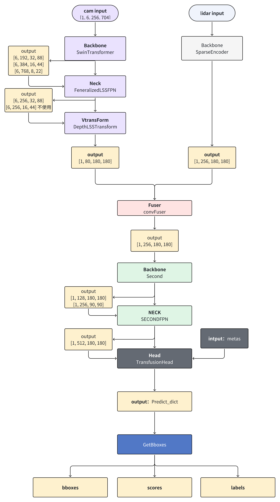

#### 问题

- 网络结构

- 输入的图像数据格式？

- 输入的点云数据格式？点数限制？

- 图像数据进行了哪些预处理操作？

- backbone、neck、head的输入输出张量大小？

- gt是什么格式？

- 损失都包含呢些内容？

- bevpool怎么进行的优化

- 都有哪些模块？

  - Encoder

    - 图像的backbone：**SwinTransformer、ResNet**
    - 图像的neck：**GeneralizedLSSFPN、SECONDFPN**
    - 图像的vtransformer：**DepthLSSTransform、LSSTransform、AwareDBEVDepth**
    - 激光的voxelize
    - 激光的backbone：**SparseEncoder、PointPillarsEncoder、RadarEncoder**

    - Fuser
      - ConvFuser

  - Decoder

    - backbone：**SECOND、GeneralizedResNet**
    - neck：**SECONDFPN、LSSFPN**

  - Head
    - TransFusionHead、CenterHead


# Pipeline



## camera

### NECK

#### GeneralizedLSSFPN

输入

- [6, **192,** 32, 88]
- [6, **384,** 16, 44]
- [6, **768,** 8, 22]

输出

- [6, 256, 32, 88]
- [6, 256, 16, 44]  下游vtransform不使用

**GeneralizedLSSFPN和PFN什么区别？**

- **GeneralizedLSSFPN‌**可以实现跨层拼接，FPN仅使用单层特征图
- GeneralizedLSSFPN‌**使用通道拼接（concat）**，FPN使用元素相加


### vtransform

输入

- [6, 256, 32, 88]

输出

- [1, 80, 180, 180]

#### LSSTransform

- **生成3D视锥**

  可以这么理解，原本是二维平面空间，对每个点扩展一个深度的概念，此时，就变为了3d空间，理解为3d网格，每个点的坐标是（x，y，d），d表示深度方向上的坐标

  根据传感器内外参将3D网格点投影到ego坐标系中（图像坐标系-->相机坐标系-->激光/ego坐标系）

- **图像编码生成3D图像特征**

  - 深度估计，一个卷积层实现，输出的通道数是D+C，D是深度采样空间的维度，C是体素特征的维度{(B * N, C, fH, fW) -->  (B\*N, C, D, fH, fW)}

- **bev pool**，输出BEV特征图

  功能：将体素空间的特征根据其空间坐标聚合到bev网格上，形成二维bev特征图

  - 计算体素特征对应的bev网格索引

  - 过滤网格之外的点

  - 将体素特征根据其空间索引聚合到bev网格上
    - 将同一个bev网格单元的点聚集在一起
    - 将统一网格单元内点的特征进行聚合（通常是相加、均值等）

  - 沿z轴进行特征合并


#### DepthLSSTransform

**点云投影 → 深度特征生成 → 空间变换 → 特征融合 → BEV聚合 → 输出**

大体流程与LSSTransform一致，新增一个**深度特征图**，系点云投影到图像中生成深度图，并将该深度图和图像特征共同送入深度估计网络层中。

**问题：点云怎么来的？**	


## lidar

待续


## Fuser

输入

- [camera_feat, lidar_feat]
- [1, 80, 180, 180]    [1, 256, 180, 180]

输出

- [1, 256, 180, 180]

```
class ConvFuser(nn.Sequential):
    def __init__(self, in_channels: int, out_channels: int) -> None:
        self.in_channels = in_channels
        self.out_channels = out_channels
        super().__init__(
            nn.Conv2d(sum(in_channels), out_channels, 3, padding=1, bias=False),
            nn.BatchNorm2d(out_channels),
            nn.ReLU(True),
        )

    def forward(self, inputs: List[torch.Tensor]) -> torch.Tensor:
        return super().forward(torch.cat(inputs, dim=1))

```

一个3乘3的二维卷积+BN+ReLU


## Decoder

### second

输入

- [1, 256, 180, 180]

输出

- [1, 128, 180, 180]
- [1, 256, 90, 90]

**网络结构**

结构由两个block组成

```
block1：
CBL(stride = 1) -> CBL * 5
输出[1, 128, 180, 180]
block2:
CBL(stride = 2) ->CBL*5
输出[1, 256, 90, 90]
```

### SECONDPFN

多尺度特征融合上采样

输入

- [1, 128, 180, 180]
- [1, 256, 90, 90]

输出

- [1, 256+256, 180, 180]


先对第一个input进行上采样，然后BN+ReLU，第二个input经过CBL，然后将两个输出cat


## Head

Transfusion：基于Transformer的检测头

CenterHead：基于中心点（Center-based）的检测头，类似于CenterNet风格的检测头

### TransFusionHead

从BEV特征中生成候选框，并通过Transformer进行多层次特征融合和目标检测

**BEV特征 → 热力图候选 → Transformer融合 → FFN预测 → 框分配与损失 → 解码输出**

输入

- bev特征
- metas

#### bev特征处理

- 对BEV特征做卷积，得到融合后的特征，统一通道数为128
- 生成heatmap，bev特征经过两层卷积和sigmoid生成热力图，再进行最大池化，筛选着相应最强的点
- 按类别和空间位置选取 top-K proposals，得到 proposal 的类别和空间索引。从 BEV 特征中采样 proposal 的特征，并加上类别嵌入。

#### transformer decoder

输入：

- query_feat：表示 proposal/query 的特征；[B, C, num_proposals]
- key(lidar_feat_flatten)：表示 BEV特征或其他需要融合的特征；主干网络输出的 BEV特征，经过 shared_conv 卷积后展平成 `[B, C, H*W]`
- query_pos：proposal/query 的空间位置坐标（如二维BEV坐标），用于位置编码；[B, H*W, 2]
- bev_pos(key_pos)：key的空间位置坐标（如BEV网格坐标），用于位置编码

多层（一层）transformer解码器，用于将proposal特征和bev特征融合，每层输出通过FFN预测头得到中心、尺寸、旋转等参数

**transformer decoder layer**

- 包含自注意力（self-attn）、交叉注意力（multihead-attn）、前馈网络（FFN）、归一化（LayerNorm）、Dropout。
- 支持空间位置编码（self_posembed/cross_posembed）。

过程

1. 位置编码，用 PositionEmbeddingLearned 对空间坐标编码，得到高维位置特征。分别对key_pos和query_pos进行编码。转换为 `[P, B, C]` 以适配后续注意力机制。
2. 对query做自注意力，融合query之间的信息；Dropout+LayerNorm
3. 交叉注意力，query与bev特征做交叉注意力，实现空间和语义信息的融合；Dropout+LayerNorm
4. 两层全连接 + 激活 + Dropout，提升特征表达能力。Dropout+LayerNorm。
5. 维度还原[B, C, P]

```
**PositionEmbeddingLearned**

- 通过两层 1D 卷积和 BN/ReLU，对空间坐标进行编码，生成绝对位置嵌入（用于 Transformer 的 query/key）。

**MultiheadAttention**

- 标准多头注意力机制，实现 query/key/value 的信息融合。

```

#### FFN预测头

`FFN` 是 `TransFusionHead` 中用于生成多任务预测结果的子模块，负责将 Transformer 解码器输出的特征转换为具体的检测任务参数（如中心点、尺寸、旋转角等）。

https://blog.csdn.net/dongtuoc/article/details/140341886


### 解析bboxes

1. **预测参数解码**：将网络输出的中心点偏移、尺寸、旋转角等参数转换为物理坐标系下的3D边界框。
2. **后处理**：包括类别感知的NMS（非极大值抑制）、分数过滤等，以去除冗余检测框。
3. **结果格式化**：返回符合目标检测任务标准格式的检测结果（框坐标、类别标签、置信度）。

**输入：**

- `preds_dicts`：包含各预测头输出的字典，关键键如下：
  - `heatmap`：分类分数，形状 `[B, num_classes, num_proposals]`
  - `center`：中心点偏移，形状 `[B, 2, num_proposals]`
  - `dim`：尺寸（长宽高），形状 `[B, 3, num_proposals]`
  - `rot`：旋转角（sin/cos编码），形状 `[B, 2, num_proposals]`
  - `vel`：速度（可选），形状 `[B, 2, num_proposals]`

- `metas`：元信息，包含点云范围、坐标系转换参数等。
- `img`/`rescale`/`for_roi`：保留参数（在3D检测中通常未使用）。

**输出**：

- 列表形式的结果，每个元素对应一个batch，包含：
  - `bboxes`：3D边界框（`LiDARInstance3DBoxes` 对象）
  - `scores`：置信度分数，形状 `[N,]`
  - `labels`：类别标签，形状 `[N,]`

#### **类别解码**

对分类分数应用 `sigmoid` 归一化到 [0,1] 区间，候选框初始热力图分数，**`one_hot`**：候选框的类别掩码。最终分数 = 预测分数 × 初始热力图分数 × 类别掩码

#### **边界框解码**

- **`bbox_coder.decode`** 完成以下转换：
  1. **中心点坐标**：将偏移量（基于BEV网格）转换为实际物理坐标（基于点云范围）。
  2. **尺寸恢复**：将网络预测的尺寸对数偏移量还原为实际长宽高。
  3. **旋转角解码**：将 sin/cos 值转换为角度（弧度制）。
  4. **速度处理**（若存在）：将速度值转换为物理单位（m/s）。
  5. **分数过滤**：根据阈值（如 `score_threshold=0.1`）初步过滤低质量预测。

#### **NMS抑制**


### 参考


https://blog.csdn.net/2301_77102499/article/details/138083499?fromshare=blogdetail&sharetype=blogdetail&sharerId=138083499&sharerefer=PC&sharesource=qq_43644906&sharefrom=from_link